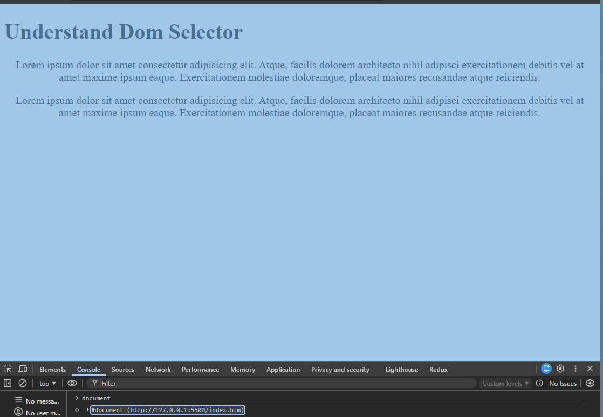
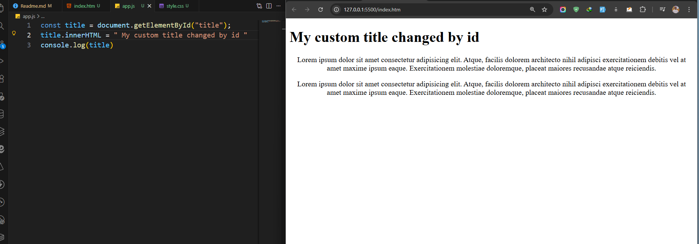
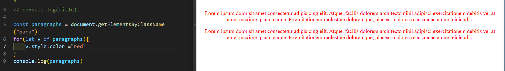

# ⭕⭕⭕DOM⭕⭕⭕
## 🔵6:39:29- What is DOM?
- Document object Model
The DOM is a structured representation of an HTML (or XML) document as a tree of objects. It allows JavaScript to access, modify, add, or remove elements, attributes, and content dynamically on a webpage.

Key points:

Tree Structure

The HTML page is represented as a tree of nodes:

document → root

html → element nodes

head, body → children

p, div, span → leaf nodes

Objects you can access

Elements (document.getElementById())

Attributes (element.setAttribute())

Text content (element.textContent)

Styles (element.style.color = "red")

Dynamic manipulation

Add/remove elements: appendChild, removeChild

Change content: innerHTML, textContent

React to events: onclick, addEventListener
<p id="demo">Hello</p>

<script>
  const p = document.getElementById("demo")
  p.textContent = "Hello World!" // changes text dynamically
  p.style.color = "blue"         // changes color dynamically
</script>


## 🔵6:45:41- What do you need to learn?
-1  dom selector 
What you’ll learn:

How to access HTML elements using JavaScript

Different ways to select elements
```js
const heading = document.getElementById('title');
console.log(heading.textContent);

```
- dom manipulation
What you’ll learn:

How to change content, style, classes, and attributes of elements using JS
```js
const p = document.querySelector('p');
p.textContent = "Hello World";   // change text
p.style.color = 'blue';          // change style
p.classList.add('active');       // add class
p.setAttribute('id','newId');    // change attribute

```

- dom creation
What you’ll learn:

How to create new HTML elements and add them to the DOM
```js
const div = document.createElement('div');  // create element
div.textContent = "New Div";                // set text
document.body.appendChild(div);             // attach to DOM

```
- dom ajax
What you’ll learn:

How to fetch data from a server without page reload

How to update the DOM dynamically with fetched data
```js
fetch('https://jsonplaceholder.typicode.com/todos/1')
  .then(response => response.json())
  .then(data => {
      const p = document.createElement('p');
      p.textContent = data.title;
      document.body.appendChild(p);
  });
```


## 🔵6:49:12- What is selector?
- js added 
```js
<!DOCTYPE html>
<html lang="en">
<head>
    <meta charset="UTF-8">
    <meta name="viewport" content="width=device-width, initial-scale=1.0">
    <title>Document</title>
    <link rel="stylesheet" href="./style.css"/>
    ✅<script src="./app.js" defer></script>
</head>
<body>
    <div class="container">
    <h1 id="title">Understand Dom Selector</h1>
    <p class="para">Lorem ipsum dolor sit amet consectetur adipisicing elit. Atque, facilis dolorem architecto nihil adipisci exercitationem debitis vel at amet maxime ipsum eaque. Exercitationem molestiae doloremque, placeat maiores recusandae atque reiciendis.</p>
    <p class="para">Lorem ipsum dolor sit amet consectetur adipisicing elit. Atque, facilis dolorem architecto nihil adipisci exercitationem debitis vel at amet maxime ipsum eaque. Exercitationem molestiae doloremque, placeat maiores recusandae atque reiciendis.</p>
    </div>
    
</body>
</html>
```
- our full html file under the document file 


 most of the case we use id selector for js

 ```js
 const title = document.getElementById("title");
title.innerHTML = " My custom title changed by id "
console.log(title)
```
## 🔵6:57:01- Get element by class
- we can cahnge the color by loop 

```js
const paragraphs = document.getElementsByClassName("para")
for(let v of paragraphs){
    v.style.color ="red"
}
console.log(paragraphs)
```
## 🔵7:02:48- Query selector
```js
// for id 
const title = document.querySelector("#title")
console.log(title)
// for all css selector
const paragraphs = document.querySelectorAll('.para')
console.log(paragraphs)
```
## 🔵7:06:38- Understand DOM element
- Dom manupulation

## 🔵7:10:20- Understand onload function
- first load then show data
```js
window.onload = function(){
main()
}

function main(){
    alert("hello munna")
}
```

## 🔵7:14:12- Handle click event
```js
window.onload = function(){
main()
}

function main(){
  const btn = document.getElementById('click-me')
//   console.log(btn)
  let times=0
//   btn.onclick = function(){
//     alert(" clicked" + times++)
//   }
// function (e) this is add event listener
btn.addEventListener('click',function(e){
    console.log(e);
       alert(" clicked " + times++)
});
}
```
## 🔵7:21:05- Change content on click

```js
window.onload = function(){
main()
}

function main(){
  const btn = document.getElementById('click-me')
const title = document.getElementById('title')
let currentTitle= title.textContent;
let nextTitle =  'change dom element '
btn.addEventListener('click',function(e){
title.innerText = nextTitle;
const temp = currentTitle
currentTitle = nextTitle
nextTitle = temp
});
}
```
## 🔵7:29:52- Change class on click

## 🔵7:36:36- Handle input events
## 🔵7:43:26- Create and Append DOM element
## 🔵7:50:14- Create DOM attribute
## 🔵7:52:42- Update innerHTML and innerTEXT
## 🔵7:56:27- Handle input events