# JavaScript Full doc 

## what is Programming?
- programming is a manual or we  language specification
if we call loop then he run for loop  and same as if call  then he run if condition its all set who make this language

- many language declaration style many type but computer just understand only (0 and 1)
- but  all language main target is understanding the computer
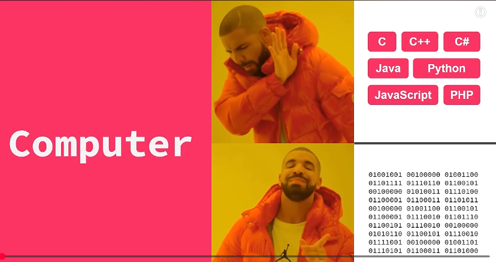

## how Does computer understanding programming language?
- computer only understand binary data (010001011101)
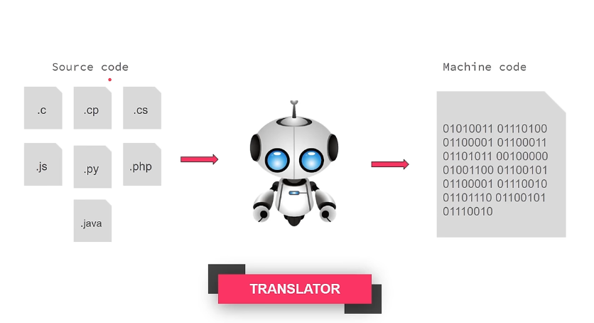

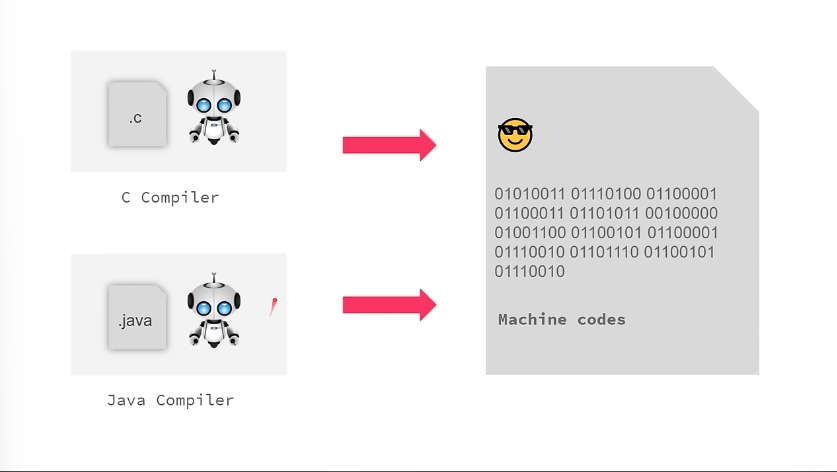

## What is compiler and why?

compiler means as a translator and  every  language have own compiler who code convert to machine codes and understood the language
0101010000010111000101010010


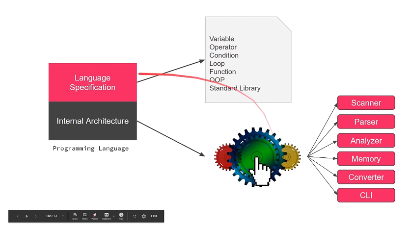

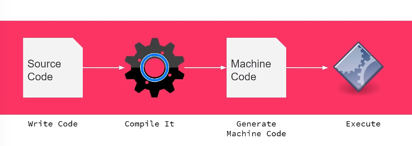

## what is programming environment?


## History of JavaScript
 1995 – Birth of JavaScript

JavaScript was created by Brendan Eich while he was working at Netscape.

The first version was developed in just 10 days.

Initially, it was named Mocha, then LiveScript, and finally JavaScript.

Despite the name, JavaScript is not related to Java. The name was mainly used for marketing purposes.

### Why JavaScript Was Created

In the early days, websites were:

Static (no interaction)

Only displayed text and images

JavaScript was introduced to:

Add interactivity to web pages

Validate forms in the browser

Respond to user actions like clicks and input

### 1997 – Standardization (ECMAScript)

JavaScript was standardized under the name ECMAScript.

This ensured JavaScript would behave consistently across different browsers.

### 2000s – Growth Era

JavaScript became essential for web development.

Libraries like jQuery simplified complex tasks.

Websites became more dynamic and user-friendly.

### 2009 – Server-Side JavaScript

Node.js was introduced, allowing JavaScript to run outside the browser.

This made JavaScript a full-stack language.

### 2015 – ES6 Revolution

ES6 (ECMAScript 2015) introduced major features like:

let and const

Arrow functions

Classes

Modules

This modernized JavaScript significantly.

###  Present Day

JavaScript is one of the most popular programming languages in the world.

Used in:

Frontend (React, Vue, Angular)

Backend (Node.js)

Mobile apps

Desktop apps

Game development

## Every thing is data

- for example your fb account 
- your image is image data
- you name is text data  as like all is data 

## why do we store data?

- in the childhood we taking the note? but why we taking note because in the exam time we learn easily important trophic from note 

### we store data Because
- we want to remember it
- we want to find it
- we want to reuse
- we want to process someway
- make data safe
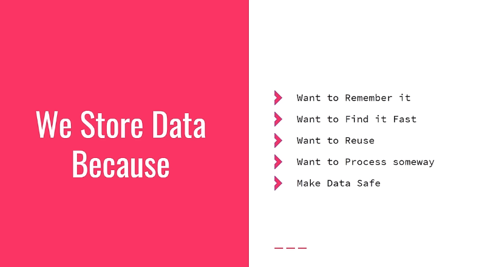

## how to store Data?
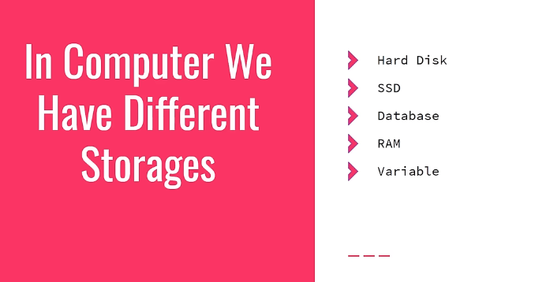
- in programming language we use variable to store temporary data 

## how to use variable in programming language 
- every variable has ------------------------
- name
- value
- optional data type 
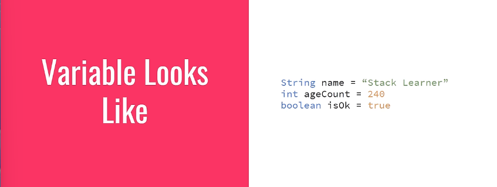


## ⭕⭕⭕ CODE STARTED⭕⭕⭕

- first create a folder and file
- and must add extension for his language for example .js

### 🔵1:05:38- Declare JavaScript VARIABLE
```js
let a = 398
let b = 239
let c = a + b
console.log(a + " + " + b + " = "+ c)
console.log(a + " + " + b + " = "+ (a-b))
console.log(a + " + " + b + " = "+ (a * b))
console.log(a + " + " + b + " = "+ (a / b))
```
### 🔵1:19:23- What is Data Type?
- string data 
- number data
- boolean data 

### 🔵1:24:06 -Data type in JavaScript
-  primitive data its mean who store value not reference
```js
let a= 32;
let b = 3.4;
let c = "munna";
let d = true;
let e 
let f = null;

console.log(typeof a)
console.log(typeof b)
console.log(typeof c)
console.log(typeof d)
console.log(typeof e)
console.log(typeof f)
```

### 🔵1:28:24-JavaScript Naming Convension

- create variable or function use first word small later then if need next word use capital letter 
this is 
```js
// camelcase
let myName = "munna",
// snackCase
let my_Name = "munna",
// PascalCase
let my-Name = "munna",
```
- dont use reserve keyword
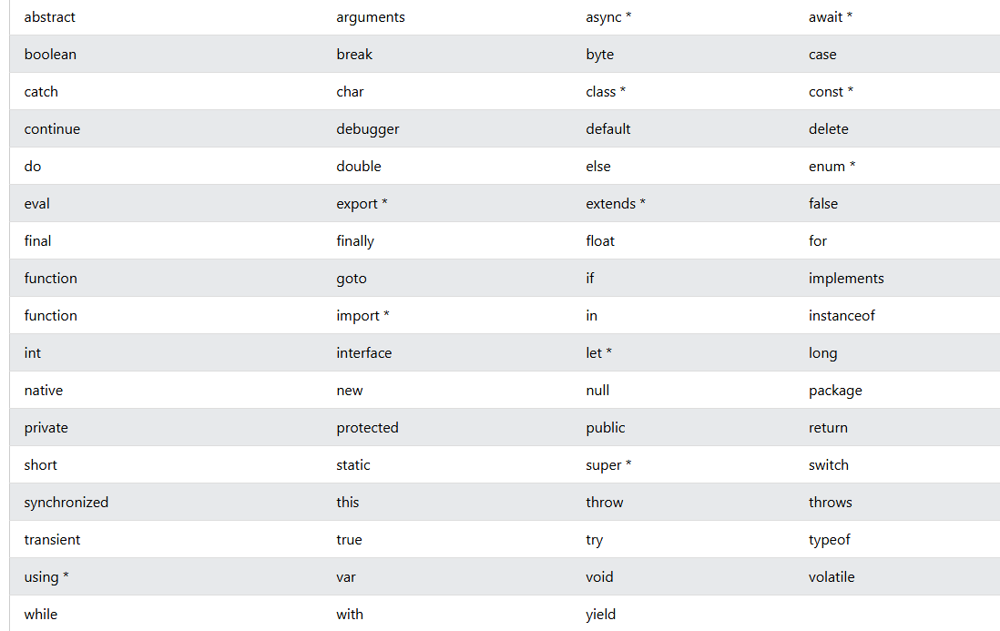

 # ⭕⭕⭕ OPERATOR ⭕⭕⭕ 

### 🔵1:32:57- OPERATOR operator mean driver  or guider
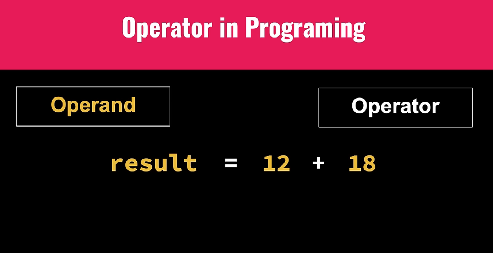

### 🔵1:36:57-Type of operators
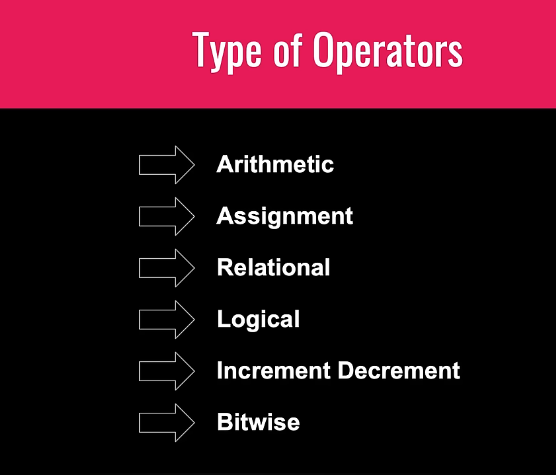

### 🔵2:01:54- Arithmetic and Assignment Operators
`1`  Arithmetic Operator
  - 1 add (+)
  - 2 subtraction (-)
  - 3 Multiplication (*)
  - 4 Division (/)
  - Modulus (%)
  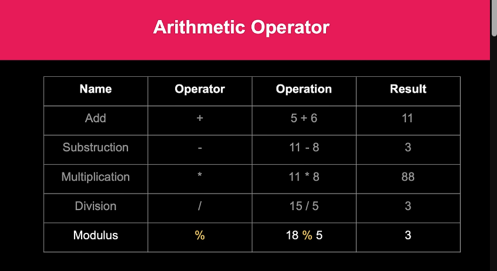

  `2` Assignment Operator
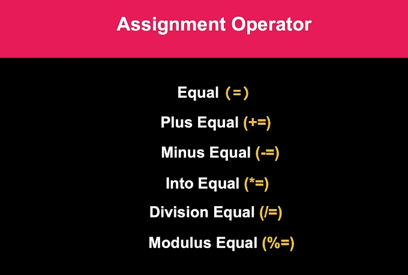
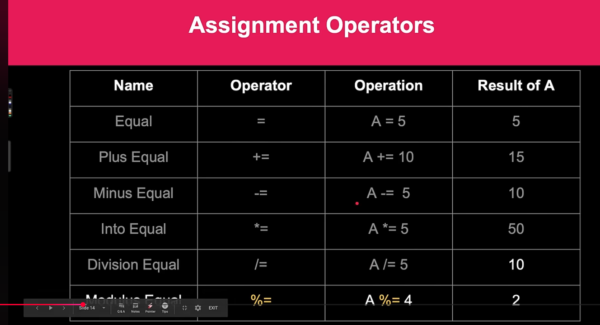
```js
 console.log("arithmatic operator")
 let a =20
 let b =30

 console.log(a+b)
 console.log(a-b)
 console.log(a*b)
 console.log(a/b)
 console.log(a%b)

  console.log("assignment operator operator")
  let number =20
  console.log(number)
  number +=5
  console.log(number)
  number -=4
   console.log(number)
     number *=4
 console.log(number)
  number /=4
   console.log(number)
     number %=2
     console.log(number)
 ```

 `3` Relational Operator
 > greater than its mean big
 < less than its mean small 
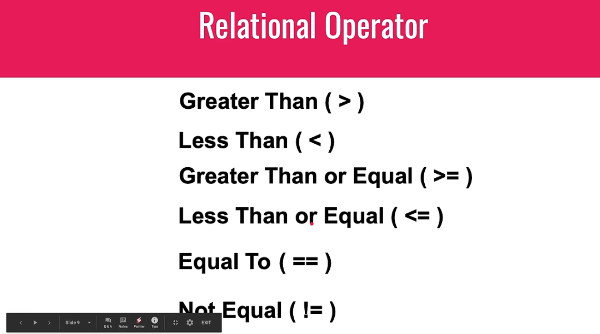
```js
// relational operator
let a = 10 ; let b= 10 ; let c = 50

console.log( a>c )
console.log( b < a)
console.log( b >=b)
console.log( a !=b)
```

 `4` logical Operator
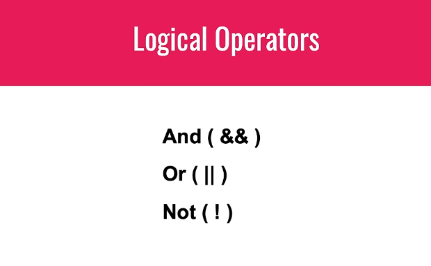
```js
// logical operation
let m = 30 ; let n = 400

let andOperation = (m > 100) && (n <500);
console.log(!andOperation)

let orOperation =  (m > 300)|| (n > 300)
console.log( orOperation)

```
### 🔵2:26:02 - Operator Importance  Precedence
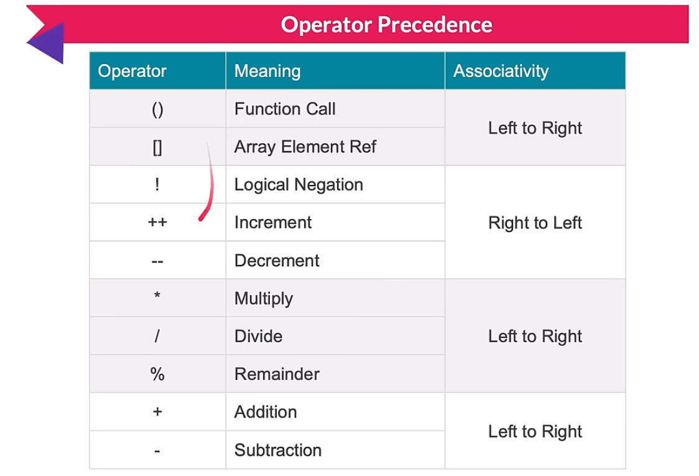

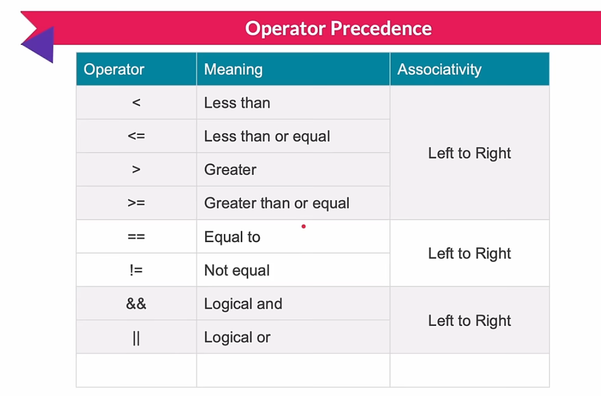
- assignment operator
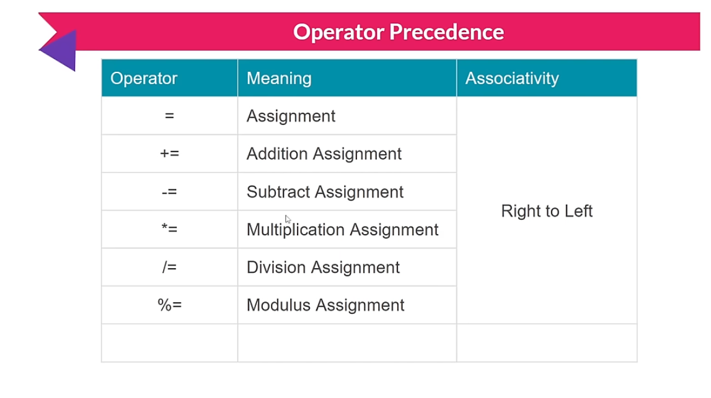

## OJ (online judge) CP (competitive Programming) What is the Different

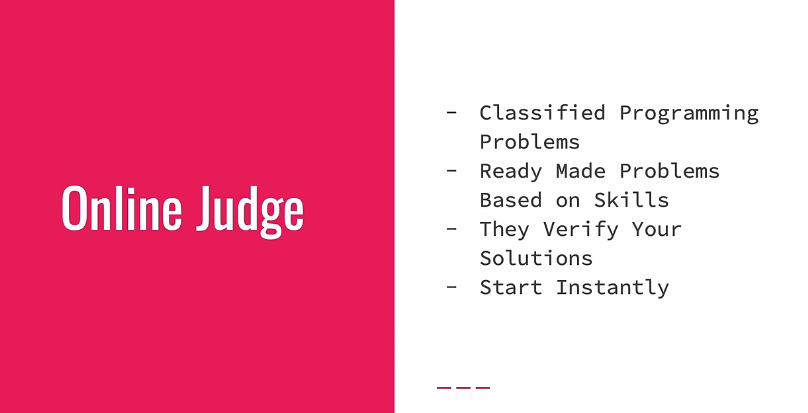

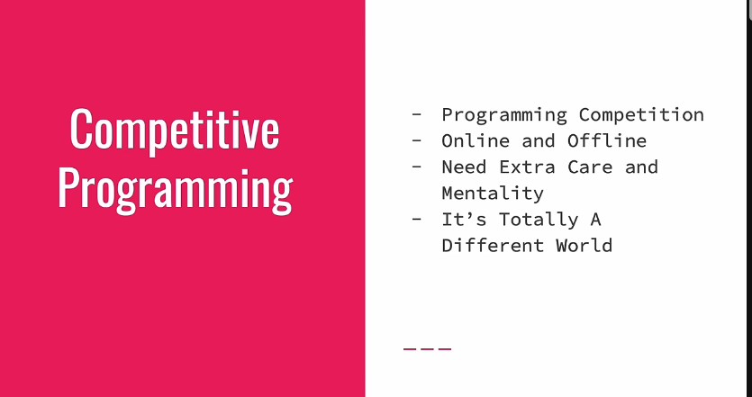

## ⭕⭕⭕CONDITION⭕⭕⭕
## Control Your program
## 🔵2:45:20- CONDITION
- condition is an expression that either can be true or false
if: some expression then -> do some work
 
- Lets Explore Conditions

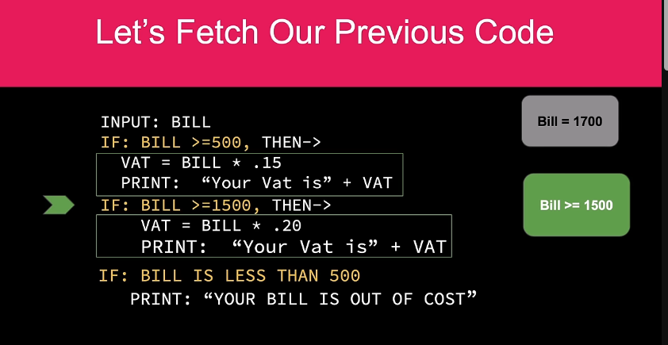

## 🔵3:01:39 - ELSE IF(understanding)
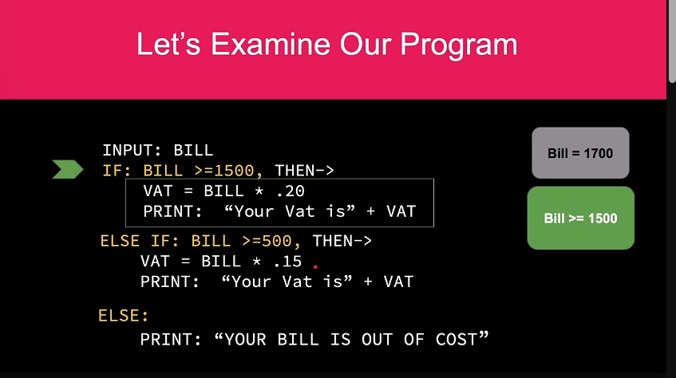

```js

// one condition use only if 
// if our logic less than 2 then use if else
// if our logic huge then use else if

const myAge = 20
const myBrotherAge = 20

if(myAge > myBrotherAge){
    console.log("i am elder")
}else if(myBrotherAge > myAge)  {
    console.log("my brother is elder")
}else{
    console.log("we are both same")
}

```
## 🔵3:17:31- SWITCH statement 

```js
// switch statement when you need exact output and dont need  comparison to other that time use switch case

const day = 20;

switch (day) {
  case 0:
    console.log("friday");
    break;
  case 1:
    console.log("saturday");
    break;
  case 2:
    console.log("sunday");
    break;
  case 3:
    console.log("monday");
    break;
  case 4:
    console.log("tuesday");
    break;
  case 5:
    console.log("wednesday");
    break;
  case 6:
    console.log("thursday");
    break;
  default:
    throw new Error("invalid input");
}
```

## 🔵3:23:40- Condition Operator
- statement does not return any thing like (if else,switch case etc) but expression return something
```js
const theme = "light";
// if condition right then output show before neither after colone output show
let bgColor =  theme ==="light"? "#dddd": "llll"

// let bgColor = ""

// if(theme === "light"){
//   bgColor = "#dddd"
// } else{
//     bgColor = "#llll"
// }
console.log(bgColor)
```
# ⭕⭕⭕ LOOP⭕⭕⭕
## 🔵3:27:44- LOOP
## 🔵3:31:27- For LOOP
```js
// we use for loop when we know start point and end point

// for(let i= 0; i <10;i++){
//     console.log("hello")
// }


let sum =0
for(let i=1; i <=15; i++ ){
    if(i % 3===0){
  sum = sum + i
    }
 
}
console.log(sum)
```


## 🔵3:38:01- While LOOP
```js
// while loop and for loop is same to same but different is we know start and ending point for loop but 
// while loop we know start but but don't know ending point for example you create a terminal base website user when failed again he can try to logged but you don't know when he successfully logged in 


// while(true){
// console.log("hwllo world")
// }


// ** variable call out of loop


// let i =1;
// while(i<100){
//     console.log(i)
//      i++
// }

let sum = 0
let i =1
while(i<=5){
sum +=i;
i++
}
console.log(sum)
```
## 🔵3:42:22 - Do While LOOP
```js
const isLoop = false;
while(isLoop){
    console.log("this Loop will never run")
}

// do while loop run minimum 1 time if loop true or false doesn't matter

do{
  console.log("it will run at least once")  
}while(isLoop)
```
## 🔵3:45:03 - For In LOOP
```js
const Fname = "Stack Learner";

// for(let i in Fname){
// console.log(i)
// }
// output // 0 1 2 3 4 5 6 7 8 9 10 11 12

for(let i in Fname){ 
console.log(Fname[i])
}

// for in loop as i always get the  index number 
// out put
// S
// t
// a
// c
// k

// L
// e
// a
// r
// n
```
## 🔵3:48:52 - For Of LOOP
```js
// for in loop return always index number
// for of loop return actual value
const cname = "stack learner"

for(let v of cname){
    console.log(v)
}

// output 
// s
// t
// a
// c
// k

// l
// e
// a
// r
// n
// e
// r
```

# ⭕⭕⭕ARRAY⭕⭕⭕


## 🔵3:51:15- Why do we need array?
- array is just a collection
- its collection of data 
- for example we have lot off eggs and you must need a tray for keep it 
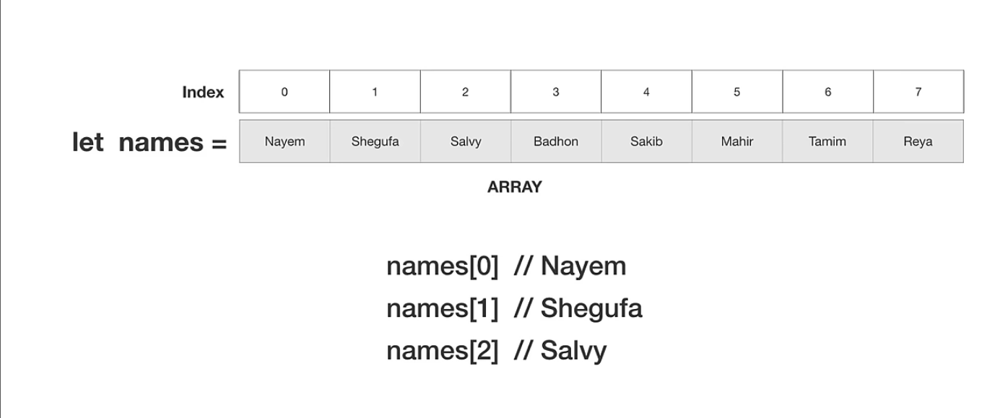
- now you know array is simple

## 🔵4:01:34- How does Array work in JS?
- step-1 create an instance example let arr=[]
- step -2 add elements example  arr[0]=34,arr[1]=67 etc
- access data when Necessary
- ----- javascript array is dynamic
- we can store anything in js

## 🔵4:07:57- What we can store in JS array?
- best practice is one kind of data store is better solution
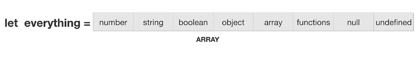
## 🔵4:09:32- What is multidimensional array?
- basically array of array
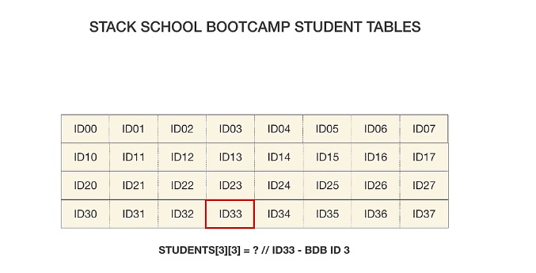
## 🔵4:15:22- Array LIteral
```js
// array Literal
// const
//  arr = []
// arr[0]= 45;
// arr[1]=34;
// arr[2]=56
// arr[1]=80
// arr[99]=200 //[ 45, 80, 56, <96 empty items>, 200 ]
// this is basic way declare arr but js is dynamic data show thats why we don't need to say call to index number
// console.log(arr.length)
// console.log(arr)
// ✅length = lastindex + 1
// ✅lastindex = length -1

const names =[
    "hm nayem",
    "rofik",
    "jabbar",
    "korim",
    "rohim",
    "raju"
]
// names[5] = "masud"  if we use update for this type it si replace 5 number index number and we lost 5 number store of data ❌
// names[names.length]='sollu' this is right way and dynamically change ✅
console.log(names.length)
console.log(names)
```
## 🔵4:25:50- Array Constructor vs Factory
```js
// constructor pattern
const a1 = new Array() // []
// new Array mean []
console.log(a1,a1.length) // [] 0
// some times need declare before length thats time we call constructor and its not work in literal array

const a2= new Array(5)
console.log(a2,a2.length)// [ <5 empty items> ] 5 // before length call

const a3 = new Array(1,2,3,4,5);
console.log(a3,a3.length)


// factory pattern
// in the factory pattern we dont need call to new keywords
const b1 =  Array() // []
// new Array mean []
console.log(b1,b1.length) // [] 0
// some times need declare before length thats time we call constructor and its not work in literal array

const b2=  Array(5)
console.log(b2,b2.length)// [ <5 empty items> ] 5 // before length call

const b3 =  Array(1,2,3,4,5);
console.log(b3,b3.length)

// testing
console.log(a1.__proto__.constructor)
console.log(b1.__proto__.constructor)
// output
// [Function: Array]
// [Function: Array]
```
## 🔵4:33:14- Traverse Array elements

```js
// loops can execute blocks of time
const arr = [14,2,33,434,43,54,90];
const n = arr[3]
const m = arr[2]
const x=1,
y=0

// console.log(m,n,arr[x],arr[y])
// output 3 4 22 11
// console.log(arr.length)

//============================  simple traverse
// easy this is repatative work we can use for in loop
// for(let i =0;i < arr.length;i++){
//     console.log(arr[i])
// }
// arr[0]
// arr[1]
// arr[2]
// arr[3]

// ========================== array sum and avg ===================================
/**
 *  sum = 0
 * sum = 0(updated sum value) + 1(next array element value) =1
 * sum = 1 + 2=3
 * sum = 3 + 3=6
 * sum = 6 + 4=10
 * sum = 10 + 5=15
 * 
 */
let sum = 0
for(let i =0;i<arr.length;i++){
     sum+= arr[i]
}
// console.log(sum)
// console.log(sum / arr.length)
// =============== find large number ======================

// const arr = [14,2,33,434,43,54,90];

let largestNumber = arr[0]
for(let i = 1;i<arr.length;i++){
    if(largestNumber <arr[i]){
        largestNumber =arr[i]
    }
}


// console.log(largestNumber)
// | Step | i | arr[i] | largestNumber (before) | Condition (`largest < arr[i]`) | largestNumber (after) |
// | ---- | - | ------ | ---------------------- | ------------------------------ | --------------------- |
// | Init | – | 14     | –                      | –                              | **14**                |
// | 1    | 1 | 2      | 14                     | 14 < 2 ❌                       | 14                    |
// | 2    | 2 | 33     | 14                     | 14 < 33 ✅                      | **33**                |
// | 3    | 3 | 434    | 33                     | 33 < 434 ✅                     | **434**               |
// | 4    | 4 | 43     | 434                    | 434 < 43 ❌                     | 434                   |
// | 5    | 5 | 54     | 434                    | 434 < 54 ❌                     | 434                   |
// | 6    | 6 | 90     | 434                    | 434 < 90 ❌                     | 434                   |


let smallestNumber = arr[0]
for(let i = 1;i<arr.length;i++){
    if(smallestNumber >arr[i]){
        smallestNumber=arr[i]
    }
}
// console.log(smallestNumber )

// | Step | i | arr[i] | smallestNumber (before) | Condition (`smallest > arr[i]`) | smallestNumber (after) |
// | ---- | - | ------ | ----------------------- | ------------------------------- | ---------------------- |
// | Init | – | 14     | –                       | –                               | **14**                 |
// | 1    | 1 | 2      | 14                      | 14 > 2 ✅                        | **2**                  |
// | 2    | 2 | 33     | 2                       | 2 > 33 ❌                        | 2                      |
// | 3    | 3 | 434    | 2                       | 2 > 434 ❌                       | 2                      |
// | 4    | 4 | 43     | 2                       | 2 > 43 ❌                        | 2                      |
// | 5    | 5 | 54     | 2                       | 2 > 54 ❌                        | 2                      |
// | 6    | 6 | 90     | 2                       | 2 > 90 ❌                        | 2                      |

const cars = ["A","B","C","D"];

for (let i = 0;i<cars.length;i++){
    console.log(i)
}
```

## 🔵4:51:05-  Update Array elements
```js
// array fill manual way

// update array manual system
const arr1= new Array(10)
// console.log(arr1) // [ <10 empty items> ]
for(let i =0;i<arr1.length;i++){
    arr1[i]= false
}

// console.log(arr1)
//[
//   false, false, false,
//   false, false, false,
//   false, false, false,
//   false
// ]

// array fill up by fill method
const arr2= new Array(10)
arr2.fill(0)
// console.log(arr2)
//[
//   0, 0, 0, 0, 0,
//   0, 0, 0, 0, 0
// ]

const names = ["munna","rofik","jabbar"];
names[0]=false
// console.log(names) // [ false, 'rofik', 'jabbar' ]

names[0]="hasan";
names[1]="sazid";
names[2]="masud";
// console.log(names) // [ 'hasan', 'sazid', 'masud' ]

const response = new Array(9)
response.fill(0)

for(let i=0;i<response.length;i++){
const rand = Math.floor(Math.random() * 10+1);

console.log(rand)
response[i] = rand > 5?"x":"0";
}
console.log(response)
// Math.random() always returns a number lower than 1.
// Math.floor() is a built-in JavaScript function that rounds a number down to the nearest integer.
// Math.floor(4.9)   // 4
// Math.floor(4.1)   // 4
// Math.floor(4.0)   // 4


// array is mutable
function update (arr){
    for(let i=0;i<arr.length;i++){
        arr[i] = `${i+1},${arr[i]}`
    }
    return arr;
}

update(names);
console.log(names)
// [ '1,hasan', '2,sazid', '3,masud' ]
```

## 🔵5:03:34-  Array of everything